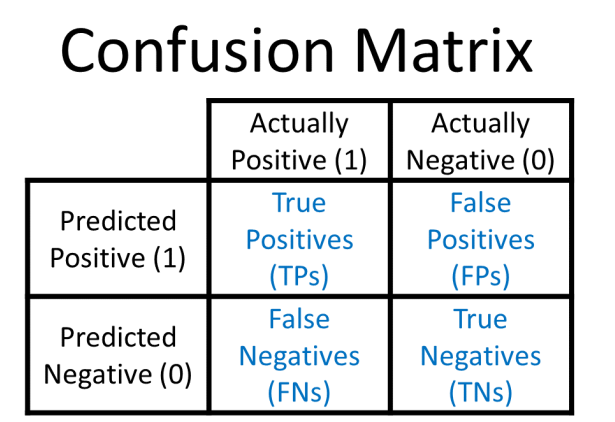
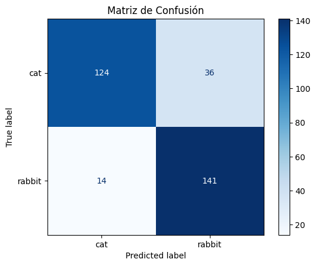
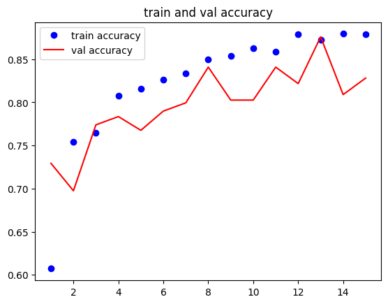
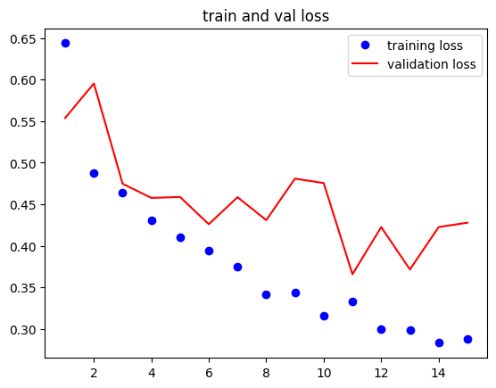
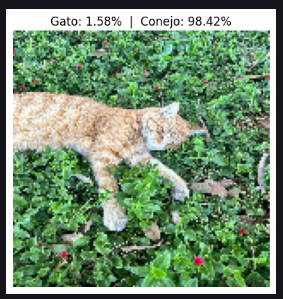
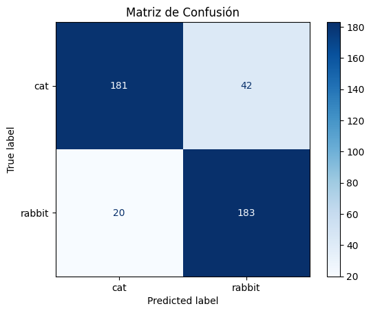
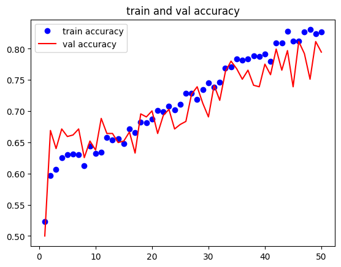
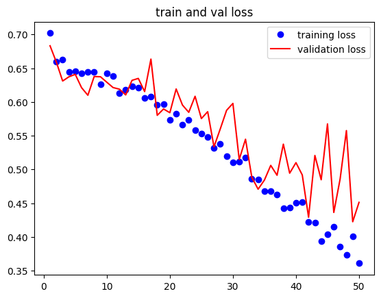
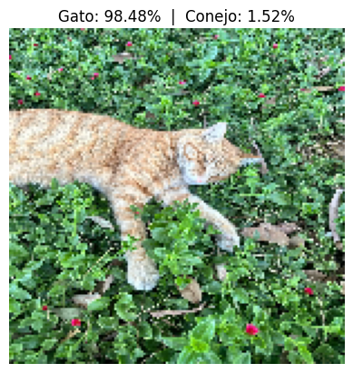
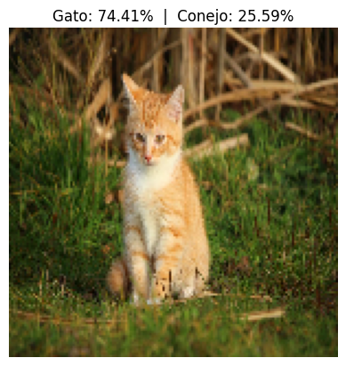

# 🐱🐰 Cats VS Rabbits Classification

## Descripción del proyecto 

Este proyecto tiene como objetivo desarrollar un modelo de aprendizaje automático  (Machine Learning) capaz de clasificar imágenes de forma binaria, identificando si pertenecen a un **gato** o un **conejo**. A través del entrenamiento con un conjunto de imágenes variadas, el modelo busca aprender a reconocer patrones visuales distintivos entre ambas especies, incluso en presencia de diferentes posturas, razas y fondos.

## Descripción del Dataset

El conjunto de datos utilizado fue obtenido de la plataforma Kaggle. Contiene imágenes de **gatos y conejos** en diversas condiciones: múltiples razas, posturas y escenarios visuales, lo que permite entrenar un modelo más robusto y generalizable.

### Características del dataset:

- Contiene **2,000 imágenes** distribuidas en las capetas test, train y validation:
    - `Cat`: 1,000 imágenes de gatos
        - Train: 800 imágenes
        - Test: 10 imágenes
        - Validation: 207 imágenes
    - `Rabbit`: 1,000 imágenes
        - Train: 800 imágenes
        - Test: 5 imágenes
        - Validation: 207 imágenes
- Formato de imagen: `.jpg`
- No contiene etiquetas adicionales como raza, edad o ubicación.
- Todas las imágenes ya han sido redimensionadas a (300, 300).

### Obtener, generar o aumentar un set de datos.
El dataset utilizado fue descargado desde la plataforma Kaggle [(Munir Yadi, “Cat vs Rabbit”)](https://www.kaggle.com/datasets/muniryadi/cat-vs-rabbit) 

Se redistribuyó de forma manual la información contenida en el dataset y realizó una limpieza en los datos que presentaban elementos no relacionados (imágenes con demasiado zoom unicamente de pelaje, imágenes de pasto) para tener un mejor equilibro en los datos para entrenar, validar y probar el modelo de ML

- Entrenamiento: 70%
    - `Cat:` 700 imágenes
    - `Rabbit`: 700 imágenes
- Validación: 15%
    - `Cat:` 150 imágenes
    - `Rabbit`: 150 imágenes
- Prueba: 15%
    - `Cat:` 150 imágenes
    - `Rabbit`: 150 imágenes
    

### Escalamiento y Preprocesado de Datos
Para mejorar el rendimiento y la capacidad de generalización del modelo, se implementaron técnicas de preprocesado utilizando TensorFlow y Keras. 

Las imágenes originales tenían un tamaño de 300x300 píxeles, pero se redimensionaron a 150x150 para poder acelerar el entrenamiento y reducir el uso de memoria (RAM o GPU) además, simplica los cálculos al disminuir la cantidad de píxeles por imagen.

Igualmente preserva suficiente información visual para tareas de clasificación binaria como en este caso es la distinción entre gatos y conejos, ya que estas clases tienen características fácilmente detectables incluso a menor resolución no hace falta tener una alta resolución para poder distinguir entre ambas especies.

- `rescale = 1./255,` : Convierte los valores de píxeles de [0, 255] a [0, 1]
- `rotation_range=20`:  Gira aleatoriamente la imagen en un rango de ±20 grados
- `width_shift_range=0.1`:  Desplaza la imagen horizontalmente hasta un 10%
- `height_shift_range=0.2`: Desplaza la imagen verticalmente hasta un 10%
- `zoom_range=0.15`: Aplica un zoom aleatorio de hasta un 15%
- `horizontal_flip = True:` Invierte horizontalmente la imagen de forma aleatoria
- `brightness_range=[0.5, 1.2]:` Ajusta aleatoriamente el brillo entre 50% y 120%

## Implementación del modelo
### Algoritmo 

La tarea de clasificar imágenes de gatos y conejos implica afrontar variaciones de iluminación, fondo, pelajes y poses. Para abordar estos desafíos se evaluaron distintos enfoques (SVM, HOG + SVM, Random Forest), pero finalmente se optó por una Convolutional Neural Network (CNN) debido a los siguientes factores clave:

- **Aprendizaje automático de características:** 
    A diferencia de HOG o SIFT, la CNN aprende jerarquías de bordes, texturas y formas directamente de los píxeles sin ingeniería manual.

- **Buen desempeño con conjuntos de datos moderados:**  
   Con solo 2 000 imágenes, técnicas de *data augmentation* (rotaciones, flips, cambios de brillo) permiten a la CNN generalizar mejor que modelos tradicionales con características fijas.

- **Flexibilidad para adaptarse a diferentes tamaños de imágenes:** 
    Las convoluciones y el pooling permiten entrenar la red con resoluciones variables sin perder detalles importantes. Esto facilita integrar fotos obtenidas con cámaras distintas (smartphone, DSLR, webcam) sin reescalar todo a un tamaño fijo, manteniendo la nitidez cuando está disponible. (Sin embargo esta se modificó por temas de rendimiento)

La elección de una Convolutional Neural Network (CNN) para la clasificación binaria de gatos y conejos se fundamenta en que, aunque ambas especies comparten rasgos generales (pelaje y siluetas similares), existen detalles visuales finos como longitud y posición de las orejas, forma del hocico, proporciones de la cabeza; que la arquitectura convolucional aprende de forma jerárquica y automática. 

El conjunto de ≈ 2 000 imágenes disponible, reforzado con técnicas de data augmentation (volteos, rotaciones leves, ajustes de brillo), proporciona la diversidad necesaria para entrenar la red reduciendo las posibilidades de tener un overtfitting.

Además, muchos de los conceptos y herramientas empleados (capas convolucionales, pooling, data augmentation, capas flatten y densas) ya se trabajaron en clase, lo que facilita la implementación práctica. Así, la CNN ofrece la combinación óptima de precisión, robustez ante variaciones de fondo e iluminación y escalabilidad para incorporar nuevas clases en el futuro con un ajuste mínimo.

### Para la implementación del modelo se utilizaron los siguientes papers:

- [Custom CNN architectures for skin disease classification: binary and multi-class performance](https://www.semanticscholar.org/paper/Custom-CNN-architectures-for-skin-disease-binary-Gupta-Nirmal/26208d4b3255702dfe9ec6b257c7a6d6d8c2dd95?)

- [Binary Image Classification Through an Optimal Topology for Convolutional Neural Networks](https://asrjetsjournal.org/index.php/American_Scientific_Journal/article/view/5938)

- [Multi-CNN models with Pretraining for Binary Classification in Skin Cancer](https://ieeexplore.ieee.org/document/9750709)

## Arquitectura de una CNN y Model
### **¿Qué es una CNN?**
Una red neuronal convolucional (CNN) es un tipo de red neuronal artificial, especialmente efectiva para el procesamiento y análisis de datos visuales como imágenes y videos. Se basa en el principio de las convoluciones para extraer características de la entrada y luego las usa para realizar tareas como clasificación, detección de objetos, segmentación, entre otras. 

Las CNN están compuestas por tres tipos de capas: 

- Capa de convolución.
- Capa de agrupación.
- Capa completamente conectada (relu y salida). 

Se elegió la arquitectura simple de los papers con el accuracy más alto para los modelos binarios, la cual consta de las siguientes capas:

- `Capa convolucional (Conv2D)` :
    - Se define una capa convolucional con 32 filtros de tamaño 3 × 3 y función de activación ReLU.
    - La capa espera entradas de imágenes con tamaño 150 × 150 píxeles y 3 canales de color (RGB).
    - Al aplicar cada filtro, se produce un mapa de activación que resalta bordes y texturas básicas presentes en las fotos de gatos y conejos.
    - ReLU deja pasar valores positivos y pone en cero los negativos para que la red aprenda mejor.

- `Capa de agrupación (MaxPooling2D)` :
    -  Se aplica un MaxPooling con ventana 2 × 2 para reducir la salida de la capa convolucional anterior.
    -  La capa de pooling reduce la dimensionalidad de la imagen al agrupar regiones adyacentes de píxeles y tomar el valor máximo de cada región
    -  Esto ayuda a reducir la cantidad de parámetros y se mantiene la información más relevante para la clasificación.

- `Segunda capa convolucional (Conv2D)` :
    - Contiene 64 filtros de tamaño 3 × 3 y activación ReLU.
    - Detecta patrones más complejos.
    - ReLU vuelve a filtrar los valores negativos, acelerando el aprendizaje.

- `Segunda capa de agrupación (MaxPooling2D)` :
    - MaxPooling 2 × 2 reduce nuevamente las dimensiones espaciales.
    - Se mantiene la información más relevante para la clasificación.

- `Tercera capa convolucional (Conv2D)` :
    - Contiene 128 filtros de tamaño 3 × 3 y activación ReLU.
    - Identifica patrones aún más complejos.

- `Tercera capa de agrupación (MaxPooling2D)` :
    - MaxPooling 2 × 2 reduce nuevamente las dimensiones espaciales.
    - Se mantiene la información más relevante para la clasificación.

- `Aplanar salida (Flatten)` :
    - Convierte la salida de las capas convolucionales y de pooling en un vector unidimensional.
    - Prepara los datos para conectarse con las neuronas densas.

- `Capa densa (Dense)` :
    - Se define primero una capa densa con 128 neuronas y función de activación ReLU.

- `Capa de salida (Dense)` :
    - Tiene 1 neurona con activación sigmoide.
    - Devuelve un valor entre 0 y 1 que indica la probabilidad de que la imagen sea de una clase (configuración típica para problemas de clasificación binaria).

- `Dropout (Dropout)` :
    - Se añade una capa Dropout con tasa 0.5 (50%), que desactiva aleatoriamente el 30% de las neuronas durante el entrenamiento.

Ayuda a prevenir el sobreajuste mejorando la capacidad de generalización del modelo.

Los papers referenciados, entrenan sus modelos entre 10 y 30 épocas, debido a la cantidad de datos utilizada se decidió entranar este primer modelo por 15 epócas. 

## Resultados y Evaluación del Modelo
### Selección de métricas
La selección de métricas tienen como referencia los papers, ya que, son las más adecuadas y comunes para evaluar modelos de clasificación binaria. 

- `Accuracy` : Una métrica para observar cuantas de las predicciones positivas son correctas. Se centra en la calidad de las predicciones positivas del modelo.

- `Precisión` : Indica cuántas de las predicciones positivas fueron realmente correctas.

    _TP / (TP / FP)_

- `Recall` : Mide cuántos de los casos positivos reales fueron correctamente detectados

    _TP / (TP / NP)_
    _
- `F1-Score` : Promedio armónico entre precisión y recall; evalúa la eficiencia general del modelo combinando la precision y el recall. 

    _(Precisión * Recall)/(Precisión + Recall)_

- `Support` : Número de muestras reales en cada clase.

    _No es una fórmula, es un conteo simple de instancias por clase_

Finalmente de forma visual se usa una matriz de confusión ya que muestra como se distribuyen las predicciónes correctas e incorrectas en cada clase 

### Primeros resultados

El modelo fue entrenado durante 15 epocas obteniendo los siguientes resultados: 

**test accuracy: 0.8413**

Posterior a eso se realizó la evaluación del modelo con las métricas mencionadas anteriormente:
| Clase   | Precisión | Recall | F1-Score | Soporte |
|---------|-----------|--------|----------|---------|
| Gato    | 0.78      | 0.78   | 0.78     | 160     |
| Conejo  | 0.80      | 0.91   | 0.85     | 155     |
| **Macro avg** | **0.80** | **0.84** | **0.84** | 315     |
| **Weighted avg** | **0.80** | **0.84** | **0.84** | 315     |

Las metricas indican que el modelo funciona mejor detectando conejos que gatos, ya que tiene mayor recall y F1-score para esa clase. Esto significa que acierta más cuando se trata de reconocer conejos, mientras que comete más errores al clasificar gatos. Las métricas promedio indican que el rendimiento es equilibrado entre ambas clases, y no hay un sesgo fuerte hacia una sola sin embargo puede mejorar en la identificación de gatos que es donde más problemas está teniendo.

#### Matriz de Confusión

Dichas métricas tambien se ven reflejadas en la matriz de confusión

- 124 (Verdaderos Positivos de Gato): El modelo clasificó correctamente 124 imágenes que realmente eran de gato.

- 141 (Verdaderos Positivos de Conejo): Clasificó correctamente 141 imágenes de conejo.

- 36 (Falsos Negativos de Gato): 36 gatos fueron mal clasificados como conejos.

- 14 (Falsos Positivos de Gato): 14 conejos fueron mal clasificados como gatos.

#### Gráficas de test y val

**Accuracy**

**Loss**

Las gráficas de entrenamiento muestran un comportamiento adecuado del modelo. 
La precisión tanto en entrenamiento como en validación mejora con el paso de las épocas, lo que indica que el modelo está aprendiendo progresivamente a clasificar correctamente las imágenes. Por otro lado, la gráfica de pérdida muestra una disminución constante en el conjunto de entrenamiento, mientras que la pérdida en validación también tiende a disminuir. Sin embargo, en ambas gráficas se observan fluctuaciones en las métricas de validación que podrían ser señales de overfitting ya que podría estar empezando a ajustarse demasiado a patrones específicos del conjunto de entrenamiento. 

### Refinamiento del modelo

A pesar de que el modelo funciona bastante bien y tiene una buenas respuestas, se notó que el dataset utilizado tiene una variedad de imágenes de conejos en césped pero no hay imágenes de gatos en estos escenarios, por lo que al poner una imagen de un gato sobre césped este suele ser mal clasificado. 

 

Por lo tanto, se realizó un aumento de imágenes al dataset de **conejos en ambientes indoor** y **gatos en ambientes de césped**. Se agregaron 600 imágenes en total manteniendo el equilibrio de 70 - 15- 15. 

 - Entrenamiento: 70%
    - `Cat:` +200 imágenes
    - `Rabbit`: +200 imágenes
- Validación: 15%
    - `Cat:` +50 imágenes
    - `Rabbit`: +50 imágenes
- Prueba: 15%
    - `Cat:` +50 imágenes
    - `Rabbit`: +50 imágenes

Debido al aumento de imagenes se decidió reajustar la arquitectura del modelo CNN con el objetivo de mejorar su capacidad de generalización, corregir errores recurrentes relacionados con el fondo de las imágenes y aprovechar la nueva información incorporada.

***Aumento de profundidad de la red:***
    - Se agregó una cuarta capa convolucional con 226 filtros para permitir que el modelo capturara patrones más complejos y de mayor nivel jerárquico.
    - Esto ayuda a detectar características más finas que distinguen a los gatos y conejos incluso en contextos visuales más complicados.

***Regularización más agresiva:***
    - Se aumentó el Dropout final a 0.5, reduciendo la probabilidad de sobreajuste al desactivar el 50% de las neuronas en la etapa densa durante el entrenamiento.
    - Se mantuvo Dropout intermedio (0.2) tras cada capa convolucional para introducir ruido controlado en el aprendizaje.

***Aumento de épocas de entrenamiento:***
    - Se incrementaron las épocas de entrenamiento de 15 a 50, aprovechando el mayor tamaño del dataset y la mayor capacidad de la arquitectura para aprender sin caer en sobreajuste. 

***Ajuste en técnicas de Data Augmentation:***
    - Se aumentó el rotation_range de 20° a 30°, incrementando la variabilidad de ángulos de entrada.
    - Se ajustó el rango de brillo (brightness_range) y el método de relleno (fill_mode='nearest') para manejar mejor los cambios de iluminación y bordes tras transformaciones.
    - Se disminuyó ligeramente el zoom_range para evitar pérdida excesiva de contexto visual.

Estos ajustes permiten al modelo adaptarse mejor a nuevas imágenes con características visuales distintas a las vistas durante el entrenamiento inicial, mejorando su capacidad de generalización y reduciendo errores sistemáticos relacionados con el fondo o las condiciones visuales.

### Resultados del modelo 

**test accuracy: 0.8545**

La matriz de confusión evidencia una mejora significativa en la clasificación de conejos (de 141 a 183 aciertos), mientras que la clasificación de gatos también mejora ligeramente (de 124 a 181 aciertos), aunque siguen siendo la clase más desafiante sin embargo está mejor clasificada.

#### Gráficas de test y val

**Accuracy**

**Loss**

Las gráficas de entrenamiento muestran un comportamiento positivo del modelo.
La precisión tanto en entrenamiento como en validación mejora de forma constante a lo largo de las 50 épocas, lo que indica que el modelo está aprendiendo progresivamente a clasificar correctamente las imágenes, sin mostrar síntomas severos de sobreajuste.

Por su parte, la gráfica de pérdida muestra una disminución clara en el conjunto de entrenamiento. Aunque la pérdida de validación presenta algunas oscilaciones, mantiene una tendencia general descendente. Las fluctuaciones son esperadas dada la mayor complejidad del modelo y el uso de data augmentation, pero no comprometen el rendimiento general.

Esto significa que las curvas de accuracy y pérdida son más estables y muestran un aprendizaje más prolongado, gracias a las 50 épocas utilizadas y al mayor volumen de datos.

Finalmente en conjunto, el segundo modelo representa un avance significativo tanto en precisión como en capacidad de generalización, y se adapta mejor a condiciones visuales diversas, cumpliendo los objetivos propuestos para el refinamiento, por lo que ya es capaz de identificar a gatos en ambientes de pasto, más complejos y de mayor precisión. 

 

